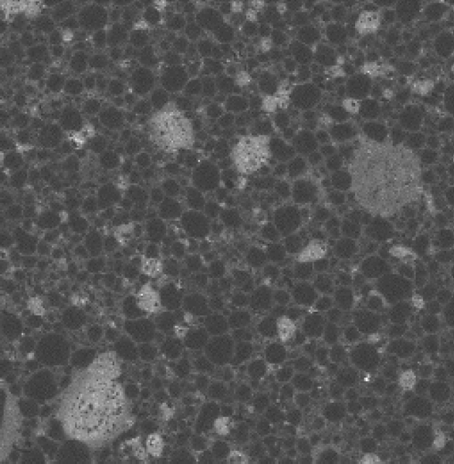

<!--
pandoc -f markdown+tex_math_single_backslash --filter pandoc-crossref --citeproc talks.md -o talks.pdf
-->

# Back to basics: an introduction to `MFront` through material properties

- Maxence Wangermez
  - CEA Cadarache, IRESNE, DES, DEC, SESC, LSC, 13 108 St Paul lez Durance, France.
- Thomas Helfer
  - CEA Cadarache, IRESNE, DES, DEC, SESC, LSC, 13 108 St Paul lez Durance, France.

**Keywords**: MFront tutorial. Material properties.

!["Plot of the Young' modulus of \(UO_{2}\) as identified by Martin et al. [@martin_elastic_1989] using `Matplotlib`"](img/material-property-tutorial.png ""){#fig:mp width=75%}

This talk provides an introduction to `MFront` by describing how to
implement material properties (i.e. simple function of the current
thermodynamic state, such as the Young's modulus) following this
tutorial: <https://thelfer.github.io/tfel/web/material-properties.html>

Since material properties are conceptually much simpler than
(mechanical) behaviours, both newcomers and people interested to know
what `MFront` is about are welcomed.

This tutorial will show how `MFront` can be used in practice, by
describing the implementation of the Young' modulus of \(UO_{2}\) as
identified by Martin et al. [@martin_elastic_1989]. Figure fig:mp
displays a graph of this property generated using `Matplotlib` in
`python` based on a `python` module generated by `MFront`.

This example allows to the main concepts behind `MFront` (code
generation and interfaces, domain specific languages, the `TFEL`
glossary, bounds and physical bounds, etc.).

Experienced users could also benefit from this new view on `MFront` as
the talk will highlight some good practices and also introduced some
advanced features that were only introduced in the latest versions.

# Overview of `TFEL-4.1` and `MGIS-2.1`.

- Thomas Helfer
  - CEA Cadarache, IRESNE, DES, DEC, SESC, LSC, 13 108 St Paul lez Durance, France.
- Maxence Wangermez
  - CEA Cadarache, IRESNE, DES, DEC, SESC, LSC, 13 108 St Paul lez Durance, France.
- Raphael Prat
  - CEA Cadarache, IRESNE, DES, DEC, SESC, LSC, 13 108 St Paul lez Durance, France.

After the massive overhaul of version 4.0, version 4.1 has seen an
impressive amount of development to improve the user experience (better
support for quantities and point-wise models, new features in the
`StandardElastoViscoplasticity` brick, possibility to customize the
behaviour of `MFront`, etc...) and to prepare the future of `MFront`
(port to GPUs, just-in-time compilation, etc...). See this page for a
full description:
<https://thelfer.github.io/tfel/web/release-notes-4.1.html>

This talk will focus on some of these developments to illustrate their
impact on end users and on solvers, notably those based on `MGIS`.

# The role of geometrically necessary dislocations flow in viscoplastic behavior of polycrystalline uranium dioxide

- Hakima Bouizem
  - CEA, DES, IRESNE, DEC, SESC, LM2C, F-13108 Saint-Paul-lez-Durance, France
  - Aix-Marseille Université, CNRS, Centrale Marseille, LMA, F-13453 Marseille Cedex 13 , France
- Étienne Castelier
  - CEA, DES, IRESNE, DEC, SESC, LM2C, F-13108 Saint-Paul-lez-Durance, France
- Vincent Taupin
  - Université de Lorraine, CNRS, Arts et Métiers, LEM3, 57070 Metz, France.
- Frédéric Lebon
  - Aix-Marseille Université, CNRS, Centrale Marseille, LMA, F-13453 Marseille Cedex 13 , France
- Jean-Marie Gatt
  - CEA, DES, IRESNE, DEC, SESC, LM2C, F-13108 Saint-Paul-lez-Durance, France

{#fig:bouizem width=75%}

**Keywords**: Geometrically Necessary Dislocations (GNDs), Field
  Dislocation Mechanics (FDM), Viscoplasticity, Dislocation
  substructures, Fast Fourier Transform (FFT).

Polycrystalline uranium dioxide (UO$_2$) is commonly used as nuclear
fuel, in Pressurized Water Reactors (PWRs), in the form of cylindrical
pellets. At high temperatures, the viscoplastic behavior of the fuel is
controlled by the dislocation motion. Microscopic investigations on
deformed pellets [@ben_saada_sub-boundaries_2017] have highlighted the
development of dislocation substructures: the dislocations were mostly
organized in sub-boundaries, subdividing the grains into sub-grains.

The formed sub-boundaries are associated to the presence of
Geometrically Necessary Dislocations (GNDs) [@kroner_continuum_1981].
Such dislocations induce a lattice curvature in order to accommodate
local deformation produced among grains and rearrange in dislocation
walls. At the polycrystal scale, one should consider the coupling of
GNDs with Statistically Stored Dislocations (SSDs). SSDs are the
dislocations of opposite orientation that mutually cancel when brought
together, have no effect on lattice curvature, and only contribute to
the plastic flow. Classical crystal plasticity models evaluate the
deformation by the single contribution of the SSDs. To include the
crystal plasticity of GNDs, an approach based on Field Dislocation
Mechanics (FDM) theory [@acharya_model_2001], which models the
deformation due to GNDs glide on slip systems, is developed. GNDs
densities are obtained through incompatible plastic deformations between
adjacent grains with different orientations, following Kröner's equation
[kroner_continuum_1981].

First, the glide velocity of GNDs and SSDs densities is identified on
UO$_2$ single crystal tests.  
Then, the proposed model is used to simulate an imposed speed
compression test of a polycrystal of UO$_2$:

- crystal plasticity model has been developed using MFront;
- mechanical equilibrium and Kröner's equation are calculaqted by Fast
  Fourier Transform (FFT) using TMFFT solver, which is connected to
  MFront.

The test, reported on Figure @fig:bouizem, shows: accumulation of GNDs
at the grain boundaries, glide within the grains, and the formation of
sub-grains. Results predicted by the model demonstrate, qualitatively, a
good agreement with the experimentally observed dislocations
substructure in deformed UO$_2$.

# Random 3D generation of MOX nuclear fuel microstructure and mechanical homogenization

- Akram el Abdi
  - CEA, DES, IRESNE, DEC, SESC, LM2C, F-13108 Saint-Paul-lez-Durance, France
  - now at EDF R&D, MMC, F-77818 Moret-sur-Loing, France
- Étienne Castelier
  - CEA, DES, IRESNE, DEC, SESC, LM2C, F-13108 Saint-Paul-lez-Durance, France
- Rodrigue Largenton
  - EDF R&D, MMC, F-77818 Moret-sur-Loing, France
- Antoine Bouloré
  - CEA, DES, IRESNE, DEC, SESC, LSC, F-13108 Saint-Paul-lez-Durance, France
- Christian Lantuéjoul
  - Centre de Géosciences, MINES ParisTech, F-77300 Fontainebleau, France
- Jean-Claude Michel
  - Aix-Marseille Université, CNRS, Centrale Marseille, LMA, F-13453 Marseille Cedex 13 , France

{#fig:elabdi width=75%}

**Keywords**: continuous random media, Mechanical calculation by FFT,
  Mechanical homogenization by NTFA, Model reduction

The MOX is a nuclear fuel composed of plutonium (Pu) and uranium oxides.
Its microstructure is recognized by maps of Pu content obtained by
electron microprobe (Figure @fig:elabdi left). The MOX texture is
classically approached by a three-phase particulate microstructure with
two inclusion phases dispersed in a continuous matrix.

In reality, the Pu content is continuous in space. The objective of this
work is to generate in 3D a new microstructure that takes into account
the continuity of Pu content, to check the effect of this continuity on
mechanical behavior by performing mechanical calculations, and finally
to identify a homogenized mechanical law based on the new
microstructure.

A new random model, based on a combination of random sets and functions,
was used to better characterize the microstructure, and its
characteristics are obtained after filtering the measurement noise from
the experimental map. The random model simulation gives a new
microstructure of three phases, with a variability of the Pu content in
each phase (Figure @fig:elabdi right).

From a mechanical point of view, the nuclear fuel is a material with
non-linear aging viscoelastic behavior and free swelling, which depends
on the local plutonium content. Mechanical calculations, using a FFT
method, were performed on the 3D generated microstructures, and the
results show that the effect of variability is important on the local
mechanical fields and the effective behavior.

Finally, the NTFA method, previously used for the same material, is
extended to take into account the Pu content variability, and optimized
by linearizing the non-linear behavior using the tangent second-order
approximation (NTFA-TSO). The law is implemented in the `MFront` format,
and tested by using `MTest` tool. The predictions of the new reduced
model are in good agreement with full-field simulations with a reduced
number of internal variables.

# Damage mechanics implementations using MFront: orthotropic, anisotropic microplane and embedded strong-discontinuity models for quasi-brittle materials

- Breno Ribeiro Nogueira
  - Université Paris-Saclay, CentraleSupélec, ENS Paris-Saclay, CNRS, LMPS - Laboratoire de Mécanique Paris-Saclay, 91190 Gif-sur-Yvette, France
  - Università degli Studi del Molise, DiBT, 86100 Campobasso, Italie
- Héloïse Rostagni
  - Université Paris-Saclay, CentraleSupélec, ENS Paris-Saclay, CNRS, LMPS - Laboratoire de Mécanique Paris-Saclay, 91190 Gif-sur-Yvette, France
- Giuseppe Rastiello
  - Université Paris-Saclay, CEA, Service d’études mécaniques et thermiques, 91191 Gif-sur-Yvette, France
- Cédric Giry
  - Université Paris-Saclay, CentraleSupélec, ENS Paris-Saclay, CNRS, LMPS - Laboratoire de Mécanique Paris-Saclay, 91190 Gif-sur-Yvette, France
- Fabrice Gatuingt
  - Université Paris-Saclay, CentraleSupélec, ENS Paris-Saclay, CNRS, LMPS - Laboratoire de Mécanique Paris-Saclay, 91190 Gif-sur-Yvette, France
- Carlo Callari
  - Università degli Studi del Molise, DiBT, 86100 Campobasso, Italie
- Frédéric Ragueneau
  - Université Paris-Saclay, CentraleSupélec, ENS Paris-Saclay, CNRS, LMPS - Laboratoire de Mécanique Paris-Saclay, 91190 Gif-sur-Yvette, France
- Ibrahim Bitar
  -  Institut de Radioprotection et de Sûreté Nucléaire (IRSN), PSN-EXP/SES/LMAPS, 92262 Fontenay-aux-Roses, France
- Benjamin Richard
  -  Institut de Radioprotection et de Sûreté Nucléaire (IRSN), PSN-EXP/SES/LMAPS, 92262 Fontenay-aux-Roses, France

**Keywords**: microplane damage, orthotropic damage, embedded strong-discontinuity, quasi-brittle materials.

Accurately predicting the response of structures subjected to complex loadings is a challenging task in civil
engineering. In particular, studying cracking nucleation and propagation is essential to assess structural
performances.

Quasi-brittle materials are generally modeled using strain-softening
constitutive models. The stress-strain material response shows a
progressive loss of stiffness right after the elastic limit. Continuum
Damage Mechanics (CDM) considers a Representative Elementary Volume
(REV) on which the homogenized material behavior is defined. According
to this approach, material degradation is represented at a macroscopic
level by a scalar or tensorial (second-order or higher) damage variable.
However, close to failure, strongly localized mechanical fields
(displacement, strain) cannot be reproduced in a relevant way in a
standard Finite Element (FE) context, which supposes a continuity of the
displacement field. In fact, when a crack is formed, the displacement
field tends to a Heaviside distribution, which gives a strain field
containing a Dirac contribution. Right after strain localization, the
transition from a regularized continuum model to an explicit description
of cracking (e.g., modeled in the Embedded FEM, E-FEM) should be applied
[@jirsek_embedded_2001;@simone_continuous_2003;@kakarla_santosh_anisotropic_2020].

This work aims to present an overall view of some `MFront`
implementations for cracking assessment in quasi-brittle materials. For
this sake, three different models and the corresponding implementations
will be presented and discussed: a microplane damage model, an
orthotropic damage model for dissipative mechanisms in masonry-like
materials, and a strong-discontinuity model developed in the E-FEM
framework. We first present a two dimensional simplified microplane
damage model [@BAZ84;@park_microplane_2003;@KAK21], and illustrate the
`MFront` implementation. Finite element simulations (see Figure
@fig:microplane) are carried out using the `Cast3M` finite element
analysis software, and mesh-independent solutions are guaranteed by
applying a simple energy-based regularization approach. Numerical
validations are performed by comparison with available results in the
literature.

!["Simulation of the Shi-test Shi et al. (2000) using the two
dimensional microplane damage model proposed by Kakarla
[@kakarla_santosh_anisotropic_2020]"](img/microplans_mfront.png){#fig:microplane
width=95%}

Then, the `MFront` implementation of an orthotropic damage model for
masonry [@tisserand_orthotropic_2022] is discussed. Three families of
cracks are identified. Damage is decomposed in their main directions and
is coupled with friction to model hysteric loops that are observed
during cyclic loading. Similarly, the new constitutive behavior is
compiled using the `Cast3M` interface, and a few numerical examples are
presented. Finally, some first results and insights about the ongoing
works on the implementation of the E-FEM (embedded cracks) method
[@ortiz_finite_1987;@simo_analysis_1993;@oliver_modelling_1996;@oliver_computational_2004]
with `MFront` are presented. According to this approach, displacement
discontinuities associated with cracks are taken into account in the
formulation. Compared to other formulations based on nodal enrichment of
the FE shape functions, the main advantage of this method is that the
enhancement field corresponding to displacement jumps can be statically
condensed at the FE level. Consequently, the numerical implementation
can be done analogously to a material behavior law.

## Acknowledgments

B. Ribeiro Nogueira was supported by a public grant overseen by the
French National research Agency (ANR) as part of the ”Investissements
d’Avenir” program, through the ”ADI 2021” project funded by the IDEX
Paris-Saclay, ANR-11-IDEX-0003-02. G. Rastiello was partly supported by
the SEISM Institute (<http://www.institut-seism.fr>). This work was also
supported by the French Institute for Radioprotection and Nuclear Safety
(IRSN).

# Modeling of VERCORS concrete behavior under severe accident scenario

- Herman Koala
  - EDF R&D, MMC, F-77818 Moret-sur-Loing, France
  - LMDC, INSA, UPS Génie Civil, F - 31077 Rangueil, France
- Jean-Luc Adia
  - EDF R&D, MMC, F-77818 Moret-sur-Loing, France
- Alain SELLIER
  - LMDC, INSA, UPS Génie Civil, F - 31077 Rangueil, France
- Thierry Vidal
  - LMDC, INSA, UPS Génie Civil, F - 31077 Rangueil, France
- Sylvie Michel-Ponnelle
  - EDF R&D, ERMES, F-91120 Palaiseau, France
- Stéphane POYET
  - CEA, DEN, DPC, SCCME, LECBA, F-91191 Gif-sur-Yvette, France

{#fig:concrete_creep
width=95%}

**Keywords**: thermal transient creep, viscoelasticity, orthotropic damage, consolidation process

Concrete is a mixture of aggregates, cement and water in well-defined
proportions depending on the desired mechanical performance. VERCORS
concrete is a standard concrete representative of the concrete used in
the double-walled containment buildings of nuclear power plants. For
numerical calculations on a macroscopic scale, the concrete is
considered as a homogeneous medium characterized mechanically by a
Young's modulus and a homogeneous Poisson's ratio.

This study is part of the deepening of knowledge on the behavior of
VERCORS concrete under accidental thermo-hydro-mechanical loading
conditions. The objective is to implement and calibrate a creep model
able to reproduce the instantaneous, transient and delayed deformations
of concrete.

The implemented viscoelastic model, based on the works of F. Manzoni et
al. [@manzoni_origins_2020] and A. Sellier [@sellier_anisotropic_2018],
allows within the framework of classical poromechanics to partition the
total external applied stress into two components; an effective stress
corresponding to the part of the total stress that is applied on the
solid skeleton; In the proposed rheological model, this component is
represented by an association of a spring for the elastic strain, a
Kelvin chain for viscoelastic creep and a Maxwell chain for purely
viscous creep. The second component of the total stress corresponds to
the water pressure allowing to take into account the effects of changes
in capillary and disjunction pressure.

During a temperature increase, an additional creep strain has been
experimentally observed [@cagnon_effects_2016] and under certain
thermo-hydric conditions, its amplitude is such that the concrete,
instead of expanding under the effect of temperature increase, contracts
instead (Figure @fig:concrete_creep). In order to take into account this
transient strain in the model, a viscous deformation rheologically
linked to the Maxwell chain was defined. The kinetics associated with
this additional creep strain is driven by a micro-diffusion equation of
water from concrete nanopores to capillary ones.

Finally, a thermo-hydric coupled orthotropic damage model has been
defined to take into account the microstructural part of the drying
creep of concrete.

The model has been implemented following an implicit scheme under
`MFront` and tests have been performed via `MTest` and `code_aster`. The
computational results show a good ability of the model to simulate the
macroscopic creep of VERCORS concrete in temperature.

# Flexible constitutive interfaces using `MFront` and `OpenGeoSys`

- Thomas Nagel
  - Geotechnical Institute, Technische Universität Bergakademie Freiberg, Germany
- Christoph Lehmann
  - Environmental Informatics, Helmholtz-Centre for Environmental Research -- UFZ, Leipzig, Germany
- Dmitri Naumov
  - Geotechnical Institute, Technische Universität Bergakademie Freiberg, Germany

**Keywords**: generic behaviour interface, THM modelling

!["THM-coupled simulations of heater experiments in clay rock [@Nagel2021_BGRZB1]."](img/heating_phase.0060.png ""){#fig:ogs width=75%}

The coupled physics of heat transport, flow of multicomponent multiphase fluids 
both in the pore space and in fractures of geological media as well as the resulting 
solid mechanical effects are of interest in many geotechnical applications. 
This includes geothermal energy extraction, geoenergy storage, carbon sequestration 
and storage, nuclear waste disposal, and buried cables for high-voltage electricity 
transfer or pipelines [@McCartney2016]. 

The continuum mechanical description of such thermo-hydro-mechanical couplings
requires a diverse range of constitutive models for the involved fluids, solids
and the various process couplings. It remains a challenge to integrate this 
extended material knowledge into numerical process simulators in a robust manner
as well as to fulfill strict verification and validation requirements in particular
for safety-critical applications such as nuclear waste disposal. 

In this contribution we highlight current development efforts to address this challenge 
including the open-source software packages OpenGeoSys [@Bilke2019], 
MFront and MGIS [@Helfer2020]. In particular, we show how different constitutive 
choices lead to different process descriptions and how that affects the finite element 
implementation. We discuss the challenge of combining different coupling or solution 
schemes along with different combinations of constitutive relations implemented 
in `MFront` or natively in `OpenGeoSys`.

#  Implementation, validations and applications of a constitutive model for crushed salt using `MFront`

- Eric Simo
  - BGE Technology, Germany
- Thomas Helfer
  - CEA Cadarache, IRESNE, DES, DEC, SESC, LSC, 13 108 St Paul lez Durance, France.
- Christian Lerch
  - BGE Technology, Germany
- Thomas Nagel
  - Geotechnical Institute, Technische Universität Bergakademie Freiberg, Germany

The isolation of radioactive waste in a high-level waste (HLW)
repository in salt formations is provided by a multi-barrier system
based on a combination of engineered and natural barriers. The natural
barrier is provided by salt rock itself, whereas the engineered barrier
is comprised of sealing components installed at specific locations in
the repository. In this concept, the long-term safety of the mined
excavations will be ensured by backfilling with crushed salt. Crushed
salt acquires its sealing capacity through compaction due to the
convergence of the rock. In this work, a model describing the mechanical
behaviour has been implemented in MFront. The validation of this model
using sensivity analyses against laboratory data has been subsequently
performed. The use of the model in a numerical application in OpenGeoSys
completes this study.
 

<!--

# Material knowledge management using the `MFrontGallery` project

- Thomas Helfer
  - CEA Cadarache, IRESNE, DES, DEC, SESC, LSC, 13 108 St Paul lez Durance, France.
- Éric Simo
  - BGE TECHNOLOGY, Eschenstrasse 55, 31224 Peine, Germany
  - Geotechnical Institute, Technische Universität Bergakademie Freiberg, Gustav-Zeuner-Str. 1, 09599 Freiberg, Germany
- Thomas Nagel
  - Geotechnical Institute, Technische Universität Bergakademie Freiberg, Gustav-Zeuner-Str. 1, 09599 Freiberg, Germany
  - Department of Environmental Informatics, Helmholtz Centre for Environmental Research -- UFZ, Permoserstr. 15, 04318 Leipzig, Germany
- Christian B. Silbermann
  - Geotechnical Institute, Technische Universität Bergakademie Freiberg, Gustav-Zeuner-Str. 1, 09599 Freiberg, Germany
- Lorenzo Riparbelli
  - University of Florence, Dagri Dept., Florence, Italy.

-->

# References