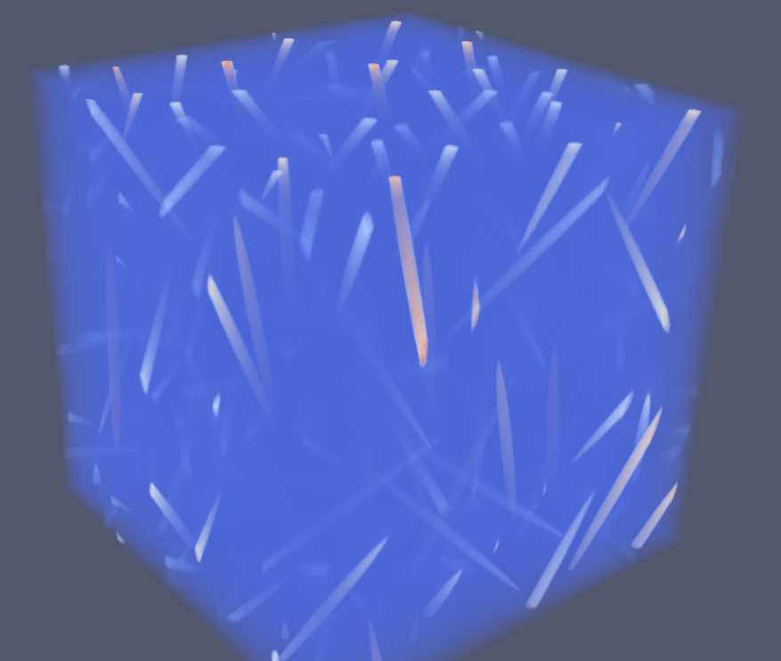

\newcommand{\Frac}[2]{{{\displaystyle \frac{\displaystyle #1}{\displaystyle #2}}}}
\newcommand{\deriv}[2]{{\displaystyle \frac{\displaystyle \partial #1}{\displaystyle \partial #2}}}
\newcommand{\derivtot}[2]{{\displaystyle \frac{\displaystyle \mathrm{d} #1}{\displaystyle \mathrm{d} #2}}}

<!--
pandoc -f markdown+tex_math_single_backslash --filter pandoc-crossref --citeproc talks.md -o talks.pdf
-->

# Overview of `TFEL-5.1`

- Thomas Helfer
  - CEA Cadarache, IRESNE, DES, DEC, SESC, LMCP, 13 108 St Paul lez Durance, France.
- Antoine Martin
  - CEA Cadarache, IRESNE, DES, DEC, SESC, LMCP, 13 108 St Paul lez Durance, France.

Version `5.0` is a port to the `TFEL` library to `C++-20` which a major
overhaul of the `TFEL/Math` and `TFEL/Material` libraries.

See this page for a full description:
<https://thelfer.github.io/tfel/web/release-notes-5.0.html>

# The new `TFEL/Material/Homogenization` library, application to 'mean-field' homogenization schemes on particulate and polycrystalline composites

- Antoine MARTIN
   -  CEA Cadarache, IRESNE, DES, DEC, SESC, LMCP, 13 108 St Paul lez Durance, France.
- Thomas Helfer
    - CEA Cadarache, IRESNE, DES, DEC, SESC, LMCP, 13 108 St Paul lez Durance, France.

{width=50% align=center}

The ANOHONA project gathers some of the best french experts in the
mean-field homogenization. One of the main goals of the project is to
democratize, simplify the implementation of the resulting constitutive
equations, and bridge the gap between academic research and industrial
studies.

In this talk, we will present the functionalities of the new
`TFEL/Material/Homogenization` library. This module provides widely used
tools of mean-field homogenization for linear materials:

- Effective properties given by classical schemes (Mori-Tanaka, dilute
  scheme, self-consistent scheme, ...)
- Eshelby and Hill tensors for various ellipsoidal inclusions, including
  isotropic and anisotropic matrix
- Computation of mean strains and localisation tensors

This module is available in `C++` and `Python`:

~~~~{.python}
polarizations=[]
crystal=Polycrystal()
for grain in grains:
    crystal.addGrain(grain)
    P=np.array([1.,1.,1.,0.,0.,0.])
    polarizations.append(P)
E=np.array([1.,0.,0.,0.,0.,0.])

hSC=computeSelfConsistent(crystal,polarizations,E)
print(hSC.stiffness)
print(hSC.mean_strains)
~~~~

This module is directly usable in `MFront` to implement nonlinear
constitutive equations based on mean-field homogenization schemes
(linear comparison composite). Particularly, three examples will be
treated:
 
- Implementation of an incremental variational scheme for a
  fiber-reinforced microstructure with linear/non-linear
  visco-elasticity.
- Implementation of an additive interaction law for an
  elasto-viscoplastic polycrystal.
- Implementation of Berveiller-Zaoui type homogenized behaviour on a
  polycrystal with arbitrary local behaviours.

As a perspective, a new brick, dedicated to mean-field homogenization,
is under-development, allowing to implement such constitutive equations
with a minimum of code.

# Elasto-Visco-Plastic behavior law for irradiated low alloy steels
  
- Ghiath MONNET
  - EDF Research and Development
- Jeremy DALPHIN
  - EDF Research and Development
- Sebastien MEUNIER
   - EDF Research and Development
- Aurore PARROT
   - EDF Research and Development

In this talk, we present a new mechanical behavior law designed for
irradiated polycrystalline low alloys steels. The law concatenates
multiscale modeling results over several time and space scales, coupled
with the Taylor homogenization rule. It accounts for temperature, strain
rate, initial and irradiated microstructure. Starting from a complete
set of constitutive equations describing crystal plasticity of
irradiated ferritic steels, simple assumptions and approximations are
made to integrate these equations over the homogenized Taylor
polycrystal. The final flow equation incorporates lattice friction,
Hall-Petch effect, static and dynamic aging, forest strengthening and
irradiation hardening controlled by the size and density of solute
clusters.

For the `MFront` implementation, we selected the `ImplicitII` Domain
Specific Language. We present this specific implicit scheme and the
special precautions to be taken to avoid divergence and numerical
inefficiency. Finally, we illustrate the interface of the MFront
behaviour with `code_aster` computations.

# Constitutive equations for porous ductile materials in `MFront`

- Jérémy Hure
   - CEA Saclay, DES, ISAS, DRMP, SEMI, LCMI, 91191 Gif-sur-Yvette, France
- Thomas Helfer
   - CEA Cadarache, DES, IRESNE, DEC, SESC, LMCP, 13108 St Paul lez Durance, France

{width=50% align=center}

The nucleation, growth, and coalescence of voids are major physical
mechanisms involved in the ductile fracture of metal alloys. Modeling
this failure mode and predicting ductile tearing requires constitutive
equations that involve porosity as an additional state variable.

Many constitutive equations have been proposed in the literature, but
only a few are available in finite element solvers. To capitalize on
these laws and provide a state-of-the-art, easy-to-use numerical
implementation of constitutive equations for porous materials, the
`MFront`'s `StandardElastoViscoPlasticity` brick was extended to porous
materials a few years ago.

First, this extension's capabilities will be reviewed in terms of
ductile tearing predictions using different FEM solvers (`Cast3M`,
`MANTA`, and `code_aster`) and `FFT` solvers (`AMITEX_FFTP`).

Second, advanced constitutive equations to be included in the
`StandardElastoViscoPlasticity` brick in the near future will be
described.

#   Identification of material parameters using a heterogeneous test and the FEMU method: application to a viscoplastic behavior law

- Thibault Barret
   - Univ. Bretagne Sud, UMR CNRS 6027, IRDL, Lorient F-56100, France
- Sandrine Thuillier
   - Univ. Bretagne Sud, UMR CNRS 6027, IRDL, Lorient F-56100, France

Numerical simulation, and in particular the finite element method, has
become a central tool in the sheet metal forming industry.

Accurately simulating these processes requires a precise description of
the mechanical behavior of metallic sheets. Identifying the parameters
of advanced constitutive models—including anisotropy, hardening, and
viscoplasticity—traditionally relies on quasi-homogeneous mechanical
tests, from which only limited information can be extracted. A promising
alternative to these time-consuming experimental campaigns is the
Material Testing 2.0 approach. It combines heterogeneous mechanical
tests with full-field measurement techniques, enabling inverse
identification of material parameters from the observed kinematic
fields.

This work follows that approach by identifying the parameters of a
viscoplastic constitutive model for a Dual Phase DP600 steel, using a
heterogeneous test performed under quick loading conditions and
processed via the Finite Element Model Updating method.

# Crystal plasticity coupled to brittle fracture

- Jean-Michel Scherer
  - Mines Paris, Université PSL, Centre des Matériaux (MAT), UMR7633 CNRS, Versailles, 78000, France
- Kaushik Bhattacharya
  - California Institute of Technology, Mechanical and Civil Engineering, Pasadena, CA 91125, USA

Recent advances in experimental methods now enable detailed
characterization of bulk microstructures and internal crack networks in
millimeter-scale samples. Concurrently, mathematical and computational
tools have progressed to effectively model the nucleation and
propagation of cracks in brittle materials. Among these, the phase-field
method has undergone significant extensions to better reflect physical
phenomena. These developments include the incorporation of anisotropic
fracture energy landscapes, coupling with plastic deformation mechanisms
[@brach_phase-field_2019], and interactions with diffusing chemical
species.

In this seminar, we narrow our focus to the microstructural scale,
particularly in materials where brittle fracture is driven by localized
plastic activity such as silicon-iron alloys, tungsten, and steels at
cryogenic temperatures. Foundational studies by Hall
[@hall_deformation_1951] and Petch [@petch_fracture_1954] demonstrated
the influence of grain size on yield and fracture strength, highlighting
prominent size effects. However, the impact of grain boundaries and
grain size on fracture toughness remains less well understood,
especially given the observed non-monotonic relationship between grain
size and fracture toughness in the micrometer range
[@reiser_elucidating_2020].

We present recent progress in modeling the interplay between crystal
plasticity and brittle fracture. Specifically, we examine how stress
heterogeneities and singularities, originating from dislocation
interactions and their interactions with grain boundaries, can act as
precursors to fracture. To this end, we introduce a modeling framework
that captures plasticity-induced brittle failure while incorporating an
intrinsic material length scale. This length scale is shown to be
critical for reproducing characteristic grain-size-dependent behavior
observed during crack initiation and propagation in polycrystalline
materials. Our approach employs a crystal plasticity constitutive
behaviour implemented in `MFront`, which is seamlessly integrated with
the finite element library `FEniCS` via the `mgis.fenics` interface.

# MFront Cohesive Zone Models for code_aster

- Goustan Bacquaert
   - EDF R&D

{width=75%}

We present the implementation of a nonlinear Cohesive Zone Model (CZM)
in `MFront`, designed to study the mechanical behavior of soil and rock
joints.

The constitutive equations are solved using a dual Lagrangian approach.
This allows us to consider properly rigid – plastic behaviours, in
constrast to purely penalized approaches. 2D finite element simulations
powered by `code_aster` demonstrate the robustness of the proposed
model.

Furthermore, we extend the CZM framework to poromechanics, allowing for
a fully coupled hydro-mechanical analysis.

# Resolution strategies for brittle and fatigue phase field damage model

- Adrien Jaccon
  -  CEA Saclay, DES, ISAS, DM2S, SEMT, LM2S, 91191 Gif-sur-Yvette, France

The phase-field damage model is a coupled problem involving two
unknowns: damage and displacement. It can be solved using a monolithic
approach - where both unknowns are treated simultaneously, at the risk
of potential convergence issues due to the lack of convexity of the
model’s functional -or using a staggered approach, in which each
sub-problem is solved sequentially while keeping the other unknown fixed
(at the cost of a potentially very slow convergence).

Various strategies have been explored in recent years, aiming either to
preserve the robustness of a monolithic algorithm, even in unstable
phases, or to accelerate the convergence of staggered schemes.

In this work, we use the flexibility of the `MFront` code and its coupling
with the `Manta` solver to test these different strategies, with the goal
of improving the computational efficiency of phase-field approaches for
brittle fracture and for high cycle fatigue crack propagation.

# Coupling MFront and FEniCS for fully-coupled chemo-thermo-poro-mechanical simulations of cement-based materials from early-age to hardened state

- Maxime Pierre
   - Navier, ENPC, Institut Polytechnique de Paris, Univ. Gustave Eiffel, CNRS, Champs-sur-Marne

We present the implementation in `MFront` of a fully coupled
chemo-thermoporomechanical model for cement-based materials, aimed at
simulating the fluid-to-solid transition of the material from its early
age to its hardened state. The model considers and a
viscoelastic-viscoplastic mechanical behaviour and partial saturation of
the pore space.

`MTest` is used to simulate complex undrained oedometric experiments on
early age class G cement paste and calibrate model parameters.

In addition, `MFront` is coupled with the `FEniCS`/`dolfinx` finite
element solver using the dolfinx_materials library to perform
structure-scale simulations. Two practical applications are showcased.

The first regards 3D printing of concrete, where we show how our
framework is able to predict failure during printing and the impact of
environmental conditions on hardened properties.

The second pertains to cementing of deep wells, in particular for
offshore \(CO_{2}\) sequestration, in which both the initial stress
state of the cement sheath of the well and thermal cycling due to
injection are crucial for well integrity.

# Using MFront Generic Behaviours for Swelling Geomaterials in `OpenGeoSys`

- Aqeel Afzal Chaudhry
- Jörg Buchwald
- Christian Bert Silbermann
  - Geotechnical Institute, Technische Universität Bergakademie
    Freiberg, Gustav-Zeuner-Str. 1, 09599 Freiberg, Germany
- Christoph Lehmann
  - Environmental Informatics, Helmholtz-Centre for Environmental
    Research -- UFZ, Leipzig, Germany
- Thomas Nagel
  - Institute of Geotechnics, Gustav Zeuner 1, TU Bergakademie Freiberg,
    Freiberg, Germany

Hydro-mechanical coupling in geomaterials can go beyond the classical
effective stress principle, leading to much stronger coupling between
the pore-pressure and stress-strain-fields. For such materials, the
evolution of hydraulic and mechanical state variables can benefit from a
joint integrator.

We have extended OpenGeoSys by a process implementation that interfaces
with the DefaultGenericBehaviour and ImplicitGenericBehaviour classes in
MFront.

In this contribution we demonstrate first implementations of elastic and
inelastic models coupled to different hydraulic features, notably
swelling. Extensions to multiple porosity levels are discussed.

# GLRC_HEGIS: homogeneous reinforced concrete behaviour for shells

- Miquel Huguet Aguilera 
  - Egis SL nucléaire, Montreuil
- Olivier Lherminier
  - Egis SL nucléaire, Montreuil
- Lucas Turgné 
  - Egis SL nucléaire, Montreuil

{width=100%}

For numerical simulations at the building scale, shell elements are
commonly used to model floors and walls. To realistically capture the
non-linear behaviour of reinforced concrete, the `GLRC_HEGIS` law was
developed as part of H. Miquel's doctoral thesis. This homogenised
reinforced concrete model incorporates four dissipative mechanisms,
enabling an accurate description of the non-linear response of
reinforced concrete structures subjected to cyclic loading. Although
initially implemented in `code_aster`, its transfer to other
computational software remains challenging.

We present here the transcription of the governing equations into
`MFront`, in plane stress, for plasticity surfaces managed by the status
method. Several strategies have been introduced to enhance the numerical
robustness of the model compared to its original implementation in
`code_aster`.

The results show good agreement with reference simulations, confirming
the validity of the implementation. Comparisons between different
solvers highlight the performance and reliability of the adapted model.
This work represents an important step towards broader portability of
the `GLRC_HEGIS` law, paving the way for its integration into diverse
computational environments and its generalised use in non-linear
structural analyses.

# Micromechanical modelling of elasto-plastic behaviour of shell-based cellular materials by coupling `FEniCS` with `MFront`

- Lei Liu
  - Chalmers University of Technology, SE-41296 Gothenburg, Sweden
- Fang Liu
  - Chalmers University of Technology, SE-41296 Gothenburg, Sweden
- Dan Zenkert
  - KTH Royal Institute of Technology, SE-10044 Stockholm, Sweden
- Malin Åkermo
  - KTH Royal Institute of Technology, SE-10044 Stockholm, Sweden
- Martin Fagerström
  - Chalmers University of Technology, SE-41296 Gothenburg, Sweden

This presentation will demonstrate an original usage of `FEniCS` and
`MFront` to investigate the complex micromechanical behaviour of
shell-based cellular materials. Cellular materials are being widely
utilized due to their appealing specific mechanical properties with
respect to low density. In particular, shell-based cellular materials
often exhibit much superior mechanical properties than beam-based ones,
thus gaining more attention. In order to understand the deformation and
failure mechanisms of shell-based cellular materials, micromechanical
modelling is performed.

A recently developed computational homogenization framework is adopted
[@liu_mesostructural_2025]. The macroscale behaviour follows a solid
continuum description. At the microscale, a representative volume
element (RVE) resolving individual cells is modelled, with the cell
walls described as Reissner-Mindlin shells in a finite rotation setting
[@campello_triangular_2003]. The base material behaviour is described
using an isotropic elasto-plastic model and integrated through the
thickness to obtain the stress resultants [@bleyer_numerical_2016],
which is implemented through `MFront`. Different loading conditions are
applied by prescribing macroscale deformation gradients.

Numerical simulations of different cellular materials are conducted
through `FEniCS`. The results show that the the cell wall membrane
deformation dominates the initial elastic region. Both the cell wall
elastic buckling and plastic collapse can lead to the failure of
shell-based cellular materials, with the competition in between strongly
depending on the relative density. A critical transition relative
density is identified.
# References {.unnumbered}

<!--
Lei Liu, Chalmers University of Technology
-->