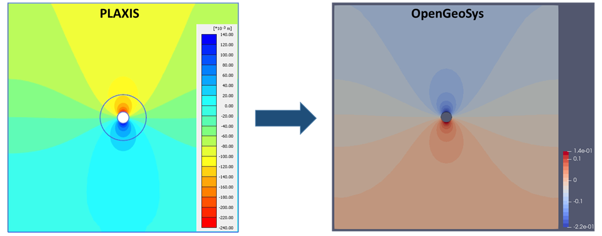
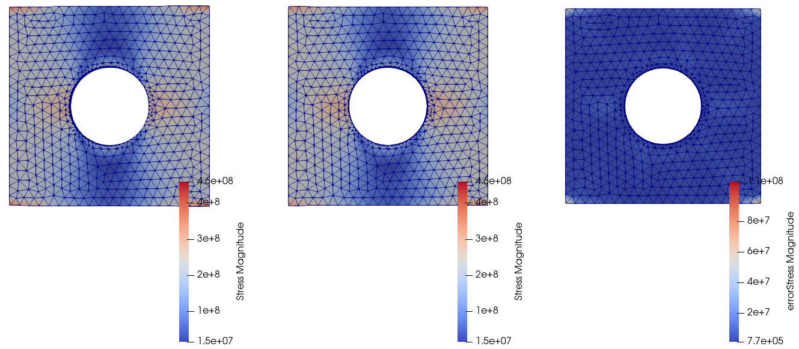

# Overview of `TFEL-4.0` and `MGIS-2.0`.

- Thomas Helfer
  - CEA Cadarache, IRESNE/DES/DEC/SESC/LSC, 13 108 St Paul lez Durance, France.

This talk will:

- Present arious applications of `MFront` during the past year which are not
  described in the other talks.
- Discuss some new features of Version 4.0 of the [`TFEL`
  project](http://tfel.sourceforge.net) and Version 2.0 of `MGIS`.

Both projects are now based on the `C++-17` standard.

As a consequence, the `TFEL/Math` library have been deeply overhauled.
From the end user point of view, the library:

- better handles quantities, i.e. values with units, allowing the
  compiler to perform dimensional analysis.
- supports higher order objects.

Quantities are now supported by the implicit domain specific languages
(DSLs) of `MFront` and the DSL dedicated to material properties.

# Development of a Novel Damage Model for Concrete Subjected to Creep

- Alexandre Gangnant
  - Sixense necs, Sceaux, France
- Michel Sagno
  - Sixense necs, Sceaux, France
- Jefri Draup
  - EDF Energy R&D UK Centre, Manchester, UK
- Thomas Helfer
  - CEA Cadarache, IRESNE/DES/DEC/SESC/LSC, 13 108 St Paul lez Durance, France.

Concrete exhibits visco-plastic behaviour when subjected to high
temperature whilst supporting an external load; this component of
plasticity is referred to as load induced thermal strain (LITS), which
is also known as transient thermal creep (TTC). LITS phenomena can be
important in pre-stressed concrete structures. Indeed, this can
potentially lead to a loss in pre-stress, and also residual tensile
stress development under transient thermal conditions. Hence, structures
which have been subjected to a high temperature thermal loading cycle
may experience cracking and subsequent loss of rigidity; this could
ultimately lead to a loss of functionality or even structural failure.
In addition to that, under pre-stressed structures, basic creep effects
might be observed in concrete and could contribute to the failure .

Thus, in a process of catching physical & mechanical phenomena that
could occur during the lifetime of a concrete structure (e.g.
Pre-stressed concrete vessel of an AGR), a novel model has been
developed in order to take into account the damage, creep and LITS
phenomena.

Firstly, a damage model (named FLB based on Mazars) coupled with LITS
model has been developed using Mfront and tested. Secondly, basic creep
has been added to this initial constitutive law. This latter coupled
model is based on simple viscoelastic creep model (Burger) in a
framework a quasi-brittle material such as concrete. The constitutive
behaviour is coupled to the damage law via the total stress tensor. By
decomposing the elastic, creep and thermal strains, the damage evolution
is driven from the elastic strains and in a proportion of creep strains.
Finally, the effective stress is computed and used to obtain the total
stress at each iteration with unilateral effect (rigidity recovery due
to crack closure) included.

This type of model is most suitable for fully implicit integration
schemes and will allow more accurate assessment of structural damage
from transient thermal events, such as fire. This work is only based on
the coupling damage and creep where thermal effect has been disabled on
purpose.

# A novel approach of using existing implementations of constitutive material models in any numerical code interfacing with `MFront`

- Eric Simo
  - BGE Technology, Germany
- Thomas Helfer (CEA)
  - CEA Cadarache, IRESNE/DES/DEC/SESC/LSC, 13 108 St Paul lez Durance, France.
- David Mašín
  - Charles University in Prague Faculty of Science Albertov 6, 128 43 Prague 2, Czech Republic 
- Thomas Nagel
  - TU Bergakademie Freiberg, Freiberg, Germany.

A novel approach of using existing implementations of constitutive
material models in any numerical code interfacing with `MFront`.

In this work, we developed a novel approach, which consists of using
existing constitutive models already available in different finite
element codes in any numerical codes interacting with `MFront`. We used
for that the versatility of the `C++` language, which allows us to
define new kind of interfaces incorporating the legacy implementation
code of constitutive equations independently from the programing
language used. These interfaces then define the necessary connections
between the constitutive models and the solver connected to `MFront`.

At this stage, the approach has been used to make available all kind of
constitutive models written in the `UMAT` format in `Fortran` into the
code [`OpenGeoSys`](https://www.opengeosys.org/). The results of a
simulation using a `UMAT`-model and the corresponding test procedure to
validate this approach will be discussed in this presentation.

# Implementation of a coupled thermo-elasto-viscoplastic polycrystalline finite element model using `FEniCS` (`mgis.fenics`) and `MFront`

- Nikhil Mohanan
  - Laboratoire de Mécanique des Solides (LMS), CNRS UMR 7649, Ecole Polytechnique, Institut Polytechnique de Paris, 91128 Palaiseau Cedex, France
- Jérémy Bleyer
  - Laboratoire Navier, CNRS UMR 8205, ENPC, Univ Gustave Eiffel, F-77447 Marne-la-Vallée, France
- Thomas Helfer
  - CEA Cadarache, IRESNE/DES/DEC/SESC/LSC, 13 108 St Paul lez Durance, France.
- Manas Upadhyay
  - Laboratoire de Mécanique des Solides (LMS), CNRS UMR 7649, Ecole Polytechnique, Institut Polytechnique de Paris, 91128 Palaiseau Cedex, France

During metal Additive Manufacturing (AM), just after deposition and
rapid solidification, the material is subjected to thermal cycling in
solid-state with different temperature amplitudes and rates until the
end of the AM process. The thermo-mechanical driving forces arising from
this Solid-State Thermal Cycling (SSTC) could trigger different
micro-mechanisms (e.g., dislocation dynamics, recrystallization, phase
transformation, etc.) that can significantly alter the as-solidified
microstructure and its subsequent mechanical response.

Our aim is to design and develop a polycrystalline
Thermo-Elasto-Viscoplastic Finite Element (T-EVP-FE) model to predict
and understand the microstructure evolution and the T-EVP response due
to SSTC during AM. This model is intended to act as a base for future
developments such as coupling with models for phase transformation,
recrystallization, etc.

The T-EVP-FE model has been implemented with the help of `MFront` and
[`FEniCS`](https://fenicsproject.org/) linked together with `MFront
Generic Interface Support` (`MGIS`). The `MFront`
`ImplicitGenericBehaviour` DSL is used to model the constitutive
behavior while [`FEniCS`](https://fenicsproject.org/) is used to solve
the coupled temperature evolution and equilibrium equations. In this
talk, we discuss the T-EVP initial boundary value problem, the
`FEniCS-MFront` solution algorithm, key features of the implemented
code, and validation with other numerical solutions.

# Implementation of a polycristalline model to simulate the radiation induced deformation of Zircaloy cladding tubes using the MFront code generation tool

- Cécilia Gicquel
  - CEA Saclay ISAS/DES/DMN/SRMA/LA2M, 91191 Gif-sur-Yvette cedex.
- Renald Brenner
  - CNRS, d'Alembert
- Renaud Masson
  - CEA Cadarache, IRESNE/DES/DEC/SESC/LSC, 13 108 St Paul lez Durance, France.
- Fabien Onimus
  - CEA Saclay ISAS/DES/DMN/SRMA/LA2M, 91191 Gif-sur-Yvette cedex.

The aim of this work is to implement a polycrystalline model in the
MFront code generation tool to simulate the radiation induced
deformation of cladding tubes made of Zircaloy. Thanks to Mandel’s
correspondence principle [@mandel_mecanique_1966] and thanks to an
internal variables formulation derived by Ricaud and Masson
[@ricaud_effective_2009], equivalent to Schapery’s collocation method
[@schapery_approximate_1962], the self-consistent scheme
[@kroner_self-consistent_2001] is applied to determine the behaviour of
a non-ageing, linear viscoelastic polycrystal. The coefficients of the
model are calibrated using the experimental data from Soniak et al.
[@soniak_irradiation_2002]. The numerical simulation is then compared,
at the macroscopic and at the local scale, with the quasi-elastic
approach developed by Brenner et al. [@brenner_quasi-elastic_2002] and
adapted to in-reactor deformation by Onimus et al.
[@onimus_polycrystalline_2021].

# Implementing geomechanical models in `MFront`/`OpenGeoSys` for hydrogeological and geotechnical applications

- Christian B. Silbermann
  - TU Bergakademie Freiberg, Freiberg, Germany.
- Dominik Kern
  - TU Bergakademie Freiberg, Freiberg, Germany.
- Francesco Parisio
  - TU Bergakademie Freiberg, Freiberg, Germany.
- Thomas Nagel
  - TU Bergakademie Freiberg, Freiberg, Germany.

In order to properly simulate complex hydrogeological or geotechnical
processes it is crucial to reasonably capture the mechanical behavior of
the geomaterials (soils or rocks, specifically). Mechanically speaking,
a constitutive relation is needed for the calculation of the effective
stress tensor as part of the constitutive closing of the
thermo-hydro-mechanical models used. Therefore, a variety of inelastic
(geo)mechanical material models is available in literature, such as the
basic and more generally applicable Mohr-Coulomb and Cambridge (Cam)
clay models along with more advanced models for specific materials and
applications such as models for rock failure in the brittle-ductile
transition or for creep in rock salt formations.

Many formulations have in comman that they need to capture effects like
elasto-plastic deformation, irreversible (plastic) pore compaction /
consolidation, hardening and softening, different loading and unloading
stiffness, and temperature dependence. The goal of this work is to
highlight recent implementations of geomechanical models in
`MFront`/`OpenGeoSys`, such as

- a consistent and clear presentation of the basic modified Cam clay
  model for cohesive soils
- models for primary, secondary and tertiary creep of rock salt
- rock mechanical models at temperatures and pressures spanning the
  brittle-ductile transition

This talk describes the implementation of several material models for
small strains in the open-source multi-field finite element software
[`OpenGeoSys`](https://www.opengeosys.org/) based on `MFront`. For this,
the set of constitutive equations and their implementation are outlined.
Then, exemplary numerical studies are presented for typical
hydrogeological and geotechnical applications demonstrating significant
differences with respect to the chosen material model.

# Validation and performance of Cosserat media in small deformation

- Tamara Dancheva
  -  Basque Center for Applied Mathematics
- Raffaele Russo
  - University of the Basque Country
- Flavien Ghiglione
  - MINES ParisTech
- Unai Alonso
  - University of the Basque Country
- Michael Barton
  - Basque Center for Applied Mathematics

In this talk, we will dive into the implementation and performance of a
Generalized Continua-based model, more specifically within the framework
of Cosserat media [@cosserat1909theorie]. We aim to use this model for
simulating the realistic behaviour of metal alloys during the process of
machining (a material removal process during which the material
undergoes severe plastic deformation). We developed this model using the
open-source FEM framework [`FEniCS`](https://fenicsproject.org/) and
`TFEL/MFront` using the
[`mgis.fenics`](https://thelfer.github.io/mgis/web/mgis_fenics.html)
module [@bleyer_overview_2020]).

We present our work on the validation and performance of the elastic and
elastoplastic model ([@forest2003elastoviscoplastic],
[@russo2020thermomechanics]) in small deformation for a representative
test case i.e. torsion test of a cylindrical specimen, by comparing the
results from [FEniCS](https://fenicsproject.org/) and TFEL/MFront with
the analytical/semi-analytical solution and a solution obtained with the
`ZSet` framework, using the `Zebulon` finite element solver.

# `MFront`, `code_aster` and wood: mechanical behaviors for structural applications and cultural heritage conservation.

{width=80%}

- Lorenzo Riparbelli
  - University of Florence, Dagri Dept., Florence, Italy.
- Ioannis Christovasilis
  - Aether Engineering, Florence, Italy.
- Marco Fioravanti
  - University of Florence, Dagri Dept., Florence, Italy.

By its nature, wood has a marked orthotropic behaviour with respect to a
cylindrical reference coordinate system, which coincides with the
development of its growth rings. Not only its elastic characteristics
vary significantly in the three anatomical directions (namely
longitudinal, radial and tangential), but it also demonstrates an
associated orthotropic viscoelastic behaviour, as well as a strong
correlation of its deformation characteristics of shrinkage and swelling
with variation of the moisture content.

This study shows how, through the use of `MFront` and the development of
dedicated material laws, it is possible to address these issues and
simulate these characteristics both for steady-state and transient
hygroscopic analyses, allowing to obtain the stress and deformation
state and history of the material. Two areas of application are
discussed; in the conservation of cultural heritage, specifically
renaissance panel paintings, and in structural engineering of timber
buildings.

# Theoretical framework of the friction and wear phenomena through of thermodynamics approaches: application to aeronautical braking

{width=80%}

- Thierry Ndzana Satoh
  - LMGC UMR5508 CNRS, Université de Montpellier, Montpellier, France.
  - SAFRAN Landing Systems, Velizy, France
- Mathieu Renouf
  - LMGC UMR5508 CNRS, Université de Montpellier, Montpellier, France.
- André Chrysochoos
  - LMGC UMR5508 CNRS, Université de Montpellier, Montpellier, France.

The limits of Archard's law, stated in [@archard1953contact] to more
precisely describe the wear in braking problems is no longer to be
demonstrated. The relation of proportionality between the volume of
material lost and the associated work as formulated empirically through
this law, does not always stick with the physical phenomena observed on
the interfaces in contact, in particular in the case of carbon braking
systems where the third body trapped in the interface in contact
defaults this Archard model. Indeed, wear in these systems, the result
of physicochemical processes and complex mechanical and dependent on
many parameters which act on time scales and different space. Some
studies in the literature come to highlight the close links between
energy that is dissipated in the system and the phenomenon of wear
[@ito2009relationship;@smerdova2014links;@shi2020tribological]. By
decoupling in this energy the contribution which comes from friction,
Zmitrowicz
[@zmitrowicz1987thermodynamicalI;@zmitrowicz1987thermodynamicalII;@zmitrowicz1987thermodynamicalIII]
or even Dragon-Louiset and Stolz [@stolz2010thermodynamical] in have
shown that it is possible to have an even more description "Real" of the
phenomenon of wear.

We propose a theoretical approach to modeling the wear of carbon brake
systems from a thermodynamic description of the problem. Quantification
of wear debris is estimated from the energy contributions related to the
damage of the contact body and the mechanism from a third body potential
trapped in the contact. The equations of states and evolutions which
govern the model, are written within the framework of generalized
standard materials.

# Implementation of neural network based constitutive models

- Marius Duvillard
  - CEA Cadarache, IRESNE/DES/DEC/SESC/LSC, 13 108 St Paul lez Durance, France.
- Loïc Giraldi
  - CEA Cadarache, IRESNE/DES/DEC/SESC/LSC, 13 108 St Paul lez Durance, France.
- Thomas Helfer
  - CEA Cadarache, IRESNE/DES/DEC/SESC/LSC, 13 108 St Paul lez Durance, France.

The characterization of the material behavior is crucial in the
resolution of mechanical problems. For decades, constitutive laws were
built thanks to parametric models depending on theoretical formalism
[@truesdell_2004]. Identifying those parameters and fitting the data is
one of the major difficulties. Therefore, modelling error and
uncertainty arise from an imperfect knowledge of the functional form of
the material laws.

More recently, different kind of data-driven models were introduced with
the use of AI, more specifically neural networks [@mehdi_pouragha_2020],
or by a minimization problem in the phase space
[@kirchdoerfer_ortiz_2016]. In the first case, neural networks allow to
easily fit the material behavior without strong mathematical *a priori*.
Moreover, it has been proved that feedforward neural networks are
universal approximators [@hornik_1989], thus they could characterize
complex material behaviors.

This talk presents different neural network based constitutive models
instead of traditional constitutive law formulations. Neural networks
enable to fit the material behavior with an expressive class of
functions. The neural network models are directly trained on a synthetic
dataset of random load tests in order to find a suitable representation
of the material behavior.

We introduce different neural network architectures for constitutive
modelling. First, we consider a feedforward network in order to
approximate a parametric nonlinear elastic model [Ramberg
Osgood](http://tfel.sourceforge.net/RambergOsgoodNonLinearElasticity.html).
Then, in order to cope with history-dependent materials, we consider a
recurrent neural network (GRU cells) to model a von Mises elasto-plastic
behavior with isotropic linear hardening [Isotropic
Hardening](http://tfel.sourceforge.net/IsotropicLinearHardeningPlasticity.html).

Finally, we demonstrate how to fit a model with `PyTorch`, integrate it
in `MFront`, and perform finite elements simulations thanks to the
`mgis.fenics` python library. We benckmark machine learning models with
classical formulations based on the results of such simulations.

# The Hybrid High Order method in nonlinear solid mechanics with `MFront` and `MGIS`

{width=80%}

- David Siedel
  - CEA Cadarache, IRESNE/DES/DEC/SESC/LSC, 13 108 St Paul lez Durance, France.
  - CEA Saclay, ISAS/DES/DM2S/SEMT/LM2S, 91191 Gif-sur-Yvette cedex.
  - Mines ParisTech, PSL University, Centre des matériaux, CNRS UMR
    7633, 91003 Évry, France.
- Thomas Helfer
  - CEA Cadarache, IRESNE/DES/DEC/SESC/LSC, 13 108 St Paul lez Durance, France.
- Olivier FANDEUR
  - CEA Saclay, ISAS/DES/DM2S/SEMT/LM2S, 91191 Gif-sur-Yvette cedex.
  - IMSIA, UMR 9219, CNRS-EDF-CEA-ENSTA Paris.
- Nicolas Pignet
  - EDF R&D
- Jacques BESSON
  - Mines ParisTech, PSL University, Centre des matériaux, CNRS UMR
    7633, 91003 Évry, France.

The standard finite element method suffers from volumetric locking when
nearly- incompressible materials are considered, leading to spurious
oscillations of the hydrostatic pressure. In order to circumvent this
phenomenon, the recent HHO (Hybrid High Order)
[@abbas_hybrid_2018;@abbas_hybrid_2019] method is considered. This
method has several advantages over standard finite elements:

- It is robust to volumetric locking phenomena in primal formulation.
- Polyhedral elements are natively supported.
- The displacements and the strains have the same approximation order.

The HHO method is hybrid as it introduces cell displacement unknowns and
faces displacement unknowns which live on the cell boundaries. In the
spirit of discontinouous Galerkin methods, displacement can be
discontinuous at the cell boundary. Cell unknowns are local and can be
condensated during the Newton iterations at the structural scale, hence
providing an attractive numerical cost.

Generic implementations of the HHO method have been developped in `C++`
([`Disk++` project](https://github.com/wareHHOuse/diskpp) project,
`CERMICS`) and in `Python` ([`H2O`
project](https://github.com/davidsiedel/h2o), CEA/MinesParisTech) to
solve non- linear mechanics problems. Both implementations can use
`MFront` generated behaviour through `MGIS`. The method has also been
introduced in industrial solvers [`code_aster`](https://code-aster.org/)
and [`Cast3M`](http://www-cast3m.cea.fr/).

In this presentation, we show the robustness of the HHO method to
volumetric locking, using non-linear behaviour laws in finite
transformations. Moreover, we show that using the HHO method polyhedral
support feature, crystalline plasticity laws can be expressed at the at
the element level, with a direct correspondence between a Voronoï cell
and an HHO polyhedral element in the mesh.

# The `MFEM-MGIS` project: coupling of `MFEM` and MGIS for High Performance non linear simulations

- Guillaume Latu
  - CEA Cadarache IRESNE/DES/DEC/SESC/LSC, 13 108 St Paul lez Durance, France.
- Thomas HELFER
  - CEA Cadarache IRESNE/DES/DEC/SESC/LSC, 13 108 St Paul lez Durance, France.

The [`MFEM-MGIS`](https://github.com/thelfer/mfem-mgis) library aims at
efficiently use supercomputers in the field of implicit nonlinear
thermomechanics. Our primary focus is to develop advanced nuclear fuel
element simulations where the evolution of materials under irradiation
are influenced by multiple phenomena, such as viscoplasticity, damage,
phase transitions, swelling due to solid and gaseous fission products.

[`MFEM`](https://mfem.org/) constitutes the pilar for providing: finite elements
abstractions, AMR handling and parallel API.

The [`MFEM-MGIS`](https://github.com/thelfer/mfem-mgis) project is
combining [`MFEM`](https://mfem.org/) with the `MFront Generic Interface
Support` library (`MGIS`), an open-source `C++` library that provides
convenient data structures to support arbitrarily complex nonlinear
constitutive equations generated by the `MFront` code generator.

This talks will discuss the goal of the project, the design of the
library (including additions made to [`MFEM`](https://mfem.org/)) and
show early results and benchmarks.

# References
