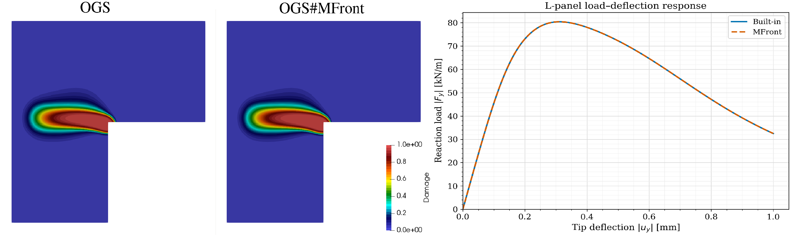

\newcommand{\Frac}[2]{{{\displaystyle \frac{\displaystyle #1}{\displaystyle #2}}}}
\newcommand{\deriv}[2]{{\displaystyle \frac{\displaystyle \partial #1}{\displaystyle \partial #2}}}
\newcommand{\derivtot}[2]{{\displaystyle \frac{\displaystyle \mathrm{d} #1}{\displaystyle \mathrm{d} #2}}}

<!--
pandoc -f markdown+tex_math_single_backslash --filter pandoc-crossref --citeproc talks.md -o talks.pdf
-->

# Open-source implementation of a flexible nonlocal scheme using MFront/OpenGeoSys

- Ammar Airoud Basmaji
- Mehran Ghasabeh
- Dmitri Naumov
- Thomas Nagel

Institut für Geotechnik, TU Bergakademie Freiberg, Gustav-Zeuner-Str. 1, 09599 Freiberg, Germany

Nonlocal integration is one possible regularization strategy used in the
modeling of softening geomaterials
[@Bazant2002; @Manica2018; @Parisio2018]. Compared to gradient-enhanced
formulations, it has the advantage of requiring no additional degrees of
freedom and being compatible with different coupling strategies.
Previous work has pointed out various limitations of different
types of nonlocal models [@rolshoven2003nonlocal], which has led to the
adoption of over-nonlocal models in some studies based on one-dimensional 
considerations.

We have implemented a scheme that gives the user flexibility in choosing 
nonlocal or over-nonlocal models of different types using `MFront` and `OpenGeoSys`.
The implementation is geared towards easy and robust use, a flexible
choice of weighting functions, and availability within all coupled
mechanical processes. We demonstrate the application of the scheme to
models that achieve softening via damage evolution or softening laws
related to plastic state variables in 1D and 2D settings. Comparisons are made
to a previous implementation without MFront interaction.

The final application case is a transversely isotropic clay model
accounting for damage as well as elastic, viscous and plastic
deformation mechanisms.

# The `TDLS` library: fast tiled linear solvers for implicit `MFront` behaviours

- Tristan Chenaille
  - CEA Cadarache, IRESNE, DES, DEC, SESC, LDOP, 13 108 St Paul lez Durance, France.
  - Aix-Marseille University, Mathematics and Computer Science Doctoral School, France.

<!-- image to come -->

In a mechanical simulation, the behaviour is integrated at every
integration point, independently of the others. This makes behaviour
integration a good candidate for GPUs. However, implicit behaviours are
typically integrated with a Newton method. Each of its iterations builds
and solves a small linear system, which puts a lot of pressure on GPU
registers. Variables that do not fit are then evicted to slow GPU
memory. The performance of `MFront`'s linear solve routine suffers from
this, and none of the existing GPU linear algebra libraries helps.

This talk presents a tiled LU solver designed for this regime, which is
embedded in the open-source
[`TDLS`](https://github.com/trsxvz/TDLS/tree/main) library. Its main
focus is to reduce register pressure and to enhance data locality and
reuse. To do this, one thread solves one system. The matrix, the
right-hand side and the pivots may each live in registers or in remote
memory. The matrix is processed as a grid of small square tiles.
Wherever the rest lives, the tiles of the current step are held in
registers. Furthermore, pivoting stays inside the current diagonal tile
unless the best local candidate is too small. The performance gains are
impressive: on an NVIDIA H100 GPU, for a Norton viscoplastic behaviour
with 12 unknowns, this solver accelerates the behaviour integration by a
factor of about 6.

This work was motivated by GPUs, but
[`TDLS`](https://github.com/trsxvz/TDLS/tree/main) is released as a
portable header-only `C++-20` library. It can run on all kinds of GPUs,
but also on CPUs, where it performs well too.
[`TDLS`](https://github.com/trsxvz/TDLS/tree/main) support is available
in the development version of `TFEL` (master branch) and will be part of
`TFEL` releases from 5.2 onwards. When enabled, `MFront` generates
behaviours that call [`TDLS`](https://github.com/trsxvz/TDLS/tree/main)
in place of its default linear solve routine. We will show how to enable
it and what to expect.

# References {.unnumbered}
